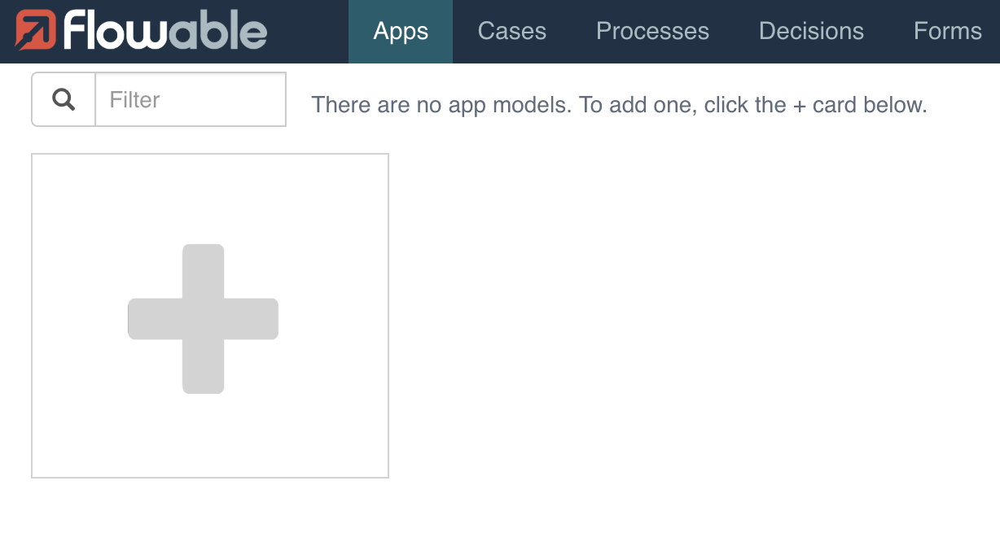
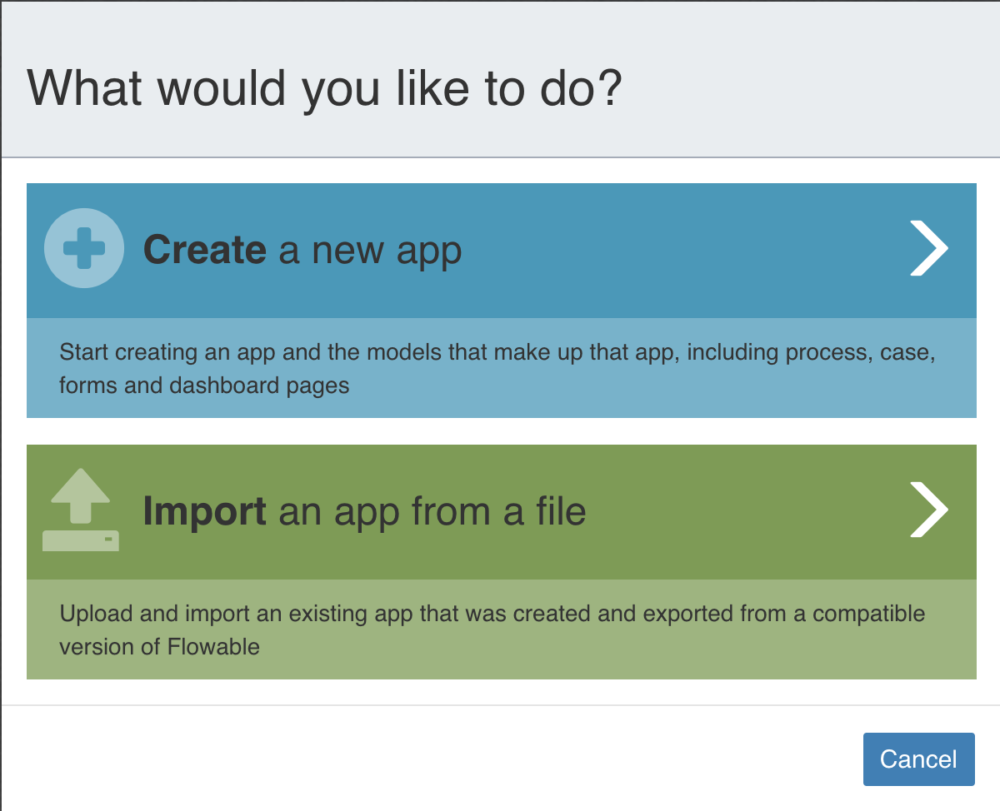
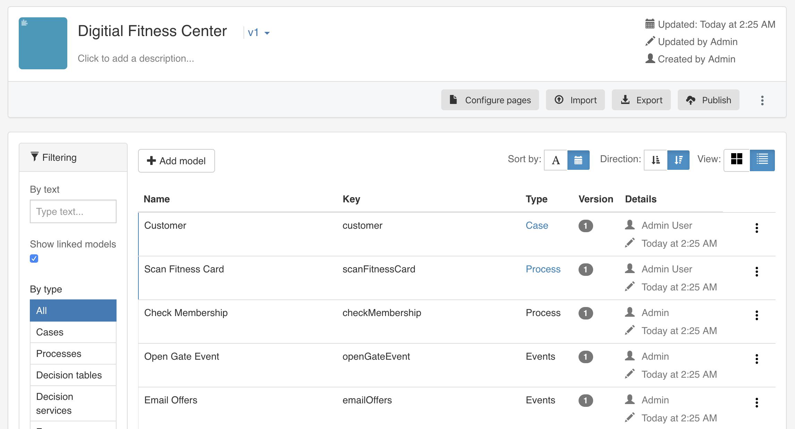

# Flowable JFS2020: Modern Could-Based Process Architectures 

This repository includes everything for the talk [Modern Cloud Process Architecture]().
There are two modes for the setup, you can either use the Enterprise Trial or the OSS version.
Both setups are docker based and described below.

## Enterprise Trial Setup

1. The enterprise product is not part of this repository.
   However, you can use this repository with the free trial.
   Therefore, you need [to download the free trial from the flowable.com website](https://flowable.com/trial/).
   You will receive an email with a license file, and an archive to download.

2. Copy the license file to [enterprise-trial/license/](enterprise-trial/license).
   Ensure the license file is named `flowable.license`.
   
3. Download the zip file linked in the trial email.
   Extract the zip file and navigate to the folder `flowable/tomcat/webapps`.
   Copy the three files from this folder and place them in [enterprise-trial/webapps/](enterprise-trial/webapps).

   Executing `find enterprise-trial` should now have the following output:
   ```
   $ find enterprise-trial
   enterprise-trial
   enterprise-trial/webapps
   enterprise-trial/webapps/.gitkeep
   enterprise-trial/webapps/flowable-design.war
   enterprise-trial/webapps/flowable-control.war
   enterprise-trial/webapps/flowable-engage.war
   enterprise-trial/license
   enterprise-trial/license/.gitkeep
   enterprise-trial/license/flowable.license
   enterprise-trial/.gitignore
   ```

4. You are now ready to startup your applications.
   Flowable, Kafka, ActiveMQ, Elasticsearch can be started through docker compose.
   Simply execute:
   ```
   docker-compose -f docker-compose-enterprise.yml up
   ``` 
   
   Hint: It's normally more performant to run the application outside of docker.
   To simplify the setup all applications are bundled into one single docker-compose file.
   
5. Wait until all apps started and open http://localhost:8888/ in your browser.
   This is the URL for Flowable Design.
   You can login with the username `admin` and the password `test`.
   
6. Once you logged in, you can import the app into Flowable Design.
   Therefore, click the large `+` button:
   
   
   On the dialog select then the green "Import an app from a file" button:
   
   
   Now drag and drop or select the [Digital_Fitness_Center-Enterprise.zip](apps/Digitial_Fitness_Center-Enterprise.zip) file from the `apps/` folder.
   The upload will take a few seconds until you see the imported application:
   
   
   You can now press the publish button in the top menu.

7. Once you published the app, the Flowable Engine is waiting for Events.
   You can go to the [Flowable Engage application](http://localhost:8080) which is handling the case execution.
   After login with the username `admin` and the password `test` you can select in the menu `Work` and then `Open`.
   Here you are going to see your members once you triggered the first case.
   For trigger the event, please continue with the setup described in the next section.

## Setup and Trigger Event with Serverless Application

Precondition: You should have the [Maven packages from Flowable Serverless](https://github.com/vzickner/flowable-serverless) installed on your machine. 

First, you can just compile the and run the source code in `flowable-serverless` with Maven.
When running the application, you need to provide two parameters.
The first parameter is the member id, the second parameter is the gate.

However, the application is intended to run with  [GraalVM `graalvm-ce-java8-20.2.0`](https://github.com/graalvm/graalvm-ce-builds/releases/tag/vm-20.2.0).
Once you downloaded GraalVM you need to install the CLI for `native-image`.
Therefore, you can use the `gu` CLI which is included inside the GraalVM package: `gu install native-image`.
Double check that `native-image` is in your path.
When you are using Mac OS X you might need to run the following command in your shell:
```bash
export PATH=/Library/Java/JavaVirtualMachines/graalvm-ce-java8-20.2.0/Contents/Home/bin:$PATH
```

Now change into the [`flowable-serverless`](flowable-serverless) directory and execute the [./build-graal-image.sh](flowable-serverless/build-graal-image.sh) script:
```bash
cd flowable-serverless
./build-graal-image.sh
```

Once the image is build, you can execute it:
```
./flowableserverless 42 Gate1
```

Note: To start this application it might be necessary to add `kafka` as localhost to your `/etc/hosts` file:
```
127.0.0.1	localhost kafka
```
The reason is that kafka is configured to listen to the hostname `kafka` instead of `localhost`, since that's the name which is used internally in the docker network.

## Start Door Application

Lastly, only the door application is missing.
This application is optional.
However, it's a great tool to see the events triggered and visualizing them.
You can simply execute in another terminal:
```
mvn -pl door-application spring-boot:run
```

The frontend is a separate Angular application.
To run the Angular app you need to have [Node](https://nodejs.org/) installed on your machine.
Once node is installed simply execute in a terminal:
```
cd door-application-ui
npm install
npm run start
```

Go to [localhost:4200](http://localhost:4200) to access the Door Application dashboard.
